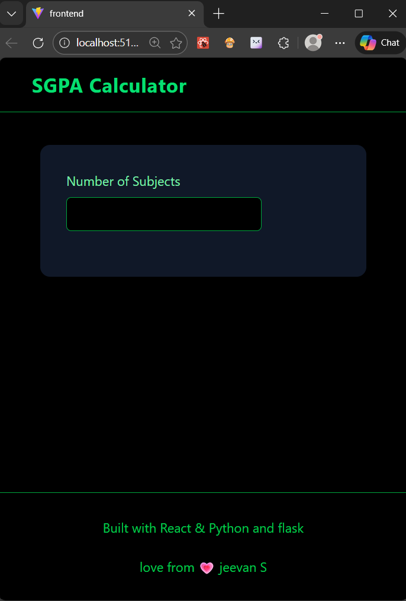
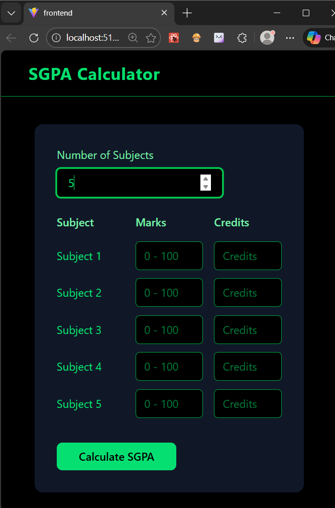
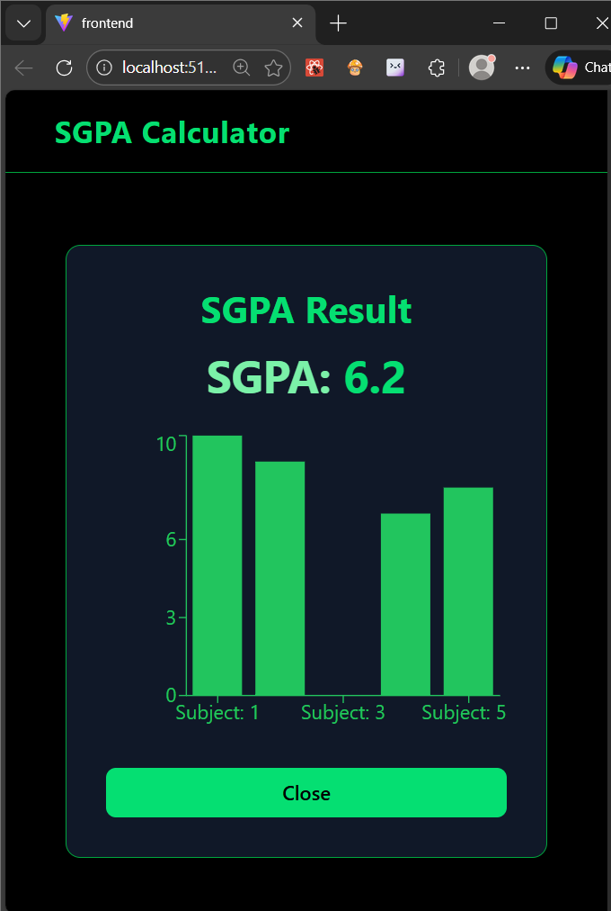

# 🎓 VTU SGPA Calculator

A modern **full-stack web application** to calculate **VTU SGPA** based on marks and credits.  
Built with a **React + Tailwind** frontend and a **Python Flask** backend, featuring animations, loaders, and data visualization.

---

## 🚀 Live Preview (Optional)
> Add your deployed link here  
`https://your-project-link.com`

---

## 🖼️ Project Screenshots

> Replace the image paths once you add screenshots





---

## ✨ Features

- 📊 VTU-based **grade point calculation**
- 🧮 **Credit-weighted SGPA** computation
- ⚡ Fast **REST API** using Flask
- 🎨 Clean & responsive UI with **Tailwind CSS**
- 🎬 Smooth animations using **Framer Motion**
- ⏳ Loading indicators using **React Spinners**
- 📈 Visual representation using **Bar Charts**
- 🌐 CORS-enabled backend for frontend integration

---

## 🛠️ Tech Stack

### Frontend
- **React (Vite)**
- **Tailwind CSS**
- **Framer Motion**
- **React Spinners**
- **Recharts**

### Backend
- **Python**
- **Flask**
- **Flask-CORS**
- **NumPy**

---

## 🧠 How SGPA is Calculated

\[
SGPA = \frac{\sum (Credit_i \times GradePoint_i)}{\sum Credits}
\]

### VTU Grade Mapping
| Marks Range | Grade Point |
|------------|-------------|
| 90 – 100 | 10 |
| 80 – 89 | 9 |
| 70 – 79 | 8 |
| 60 – 69 | 7 |
| 50 – 59 | 6 |
| 45 – 49 | 5 |
| 40 – 44 | 4 |
| < 40 | 0 |

---

## ⚙️ How to Run Locally

### 🔹 Backend (Flask)
```bash
cd backend
python app.py
